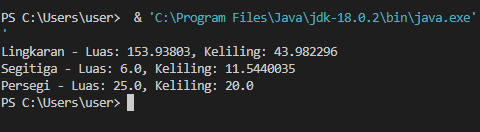

# LatPolimorfisme

# Code Program Java

``` // Kelas dasar
abstract class BangunDatar {
    abstract float luas();
    abstract float keliling();
}

// Kelas Lingkaran
class Lingkaran extends BangunDatar {
    private int r;

    public Lingkaran(int r) {
        this.r = r;
    }

    @Override
    float luas() {
        return (float) (Math.PI * r * r);
    }

    @Override
    float keliling() {
        return (float) (2 * Math.PI * r);
    }
}

// Kelas Segitiga
class Segitiga extends BangunDatar {
    private int alas;
    private int tinggi;

    public Segitiga(int alas, int tinggi) {
        this.alas = alas;
        this.tinggi = tinggi;
    }

    @Override
    float luas() {
        return 0.5f * alas * tinggi;
    }

    @Override
    float keliling() {
        // Mengasumsikan segitiga sama kaki
        double sisiMiring = Math.sqrt((alas / 2.0) * (alas / 2.0) + tinggi * tinggi);
        return (float) (alas + 2 * sisiMiring);
    }
}

// Kelas Persegi
class Persegi extends BangunDatar {
    private int sisi;

    public Persegi(int sisi) {
        this.sisi = sisi;
    }

    @Override
    float luas() {
        return sisi * sisi;
    }

    @Override
    float keliling() {
        return 4 * sisi;
    }
}

// Kelas utama
public class Utama {
    public static void main(String[] args) {
        BangunDatar lingkaran = new Lingkaran(7);
        BangunDatar segitiga = new Segitiga(3, 4);
        BangunDatar persegi = new Persegi(5);

        System.out.println("Lingkaran - Luas: " + lingkaran.luas() + ", Keliling: " + lingkaran.keliling());
        System.out.println("Segitiga - Luas: " + segitiga.luas() + ", Keliling: " + segitiga.keliling());
        System.out.println("Persegi - Luas: " + persegi.luas() + ", Keliling: " + persegi.keliling());
    }
}
```

# Output



# Penjelasan

***1. BangunDatar:*** Kelas dasar abstrak dengan metode abstrak ```luas()``` dan ```keliling()```.

***2. Lingkaran:*** Mengimplementasikan ```luas()``` dan ```keliling()``` untuk lingkaran, menggunakan jari-jari ```r```.

***3. Segitiga:*** Mengimplementasikan ```luas()``` dan ```keliling()``` untuk segitiga, menggunakan alas (```alas```) dan tinggi (```tinggi```). Keliling dihitung dengan asumsi segitiga sama kaki.

***4. Persegi:*** Mengimplementasikan ```luas()``` dan ```keliling()``` untuk persegi, menggunakan panjang sisi ```sisi```.

***5. Utama:*** Kelas utama untuk menguji luas dan keliling setiap bentuk.
